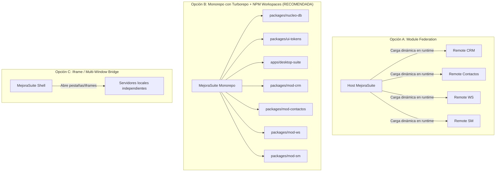
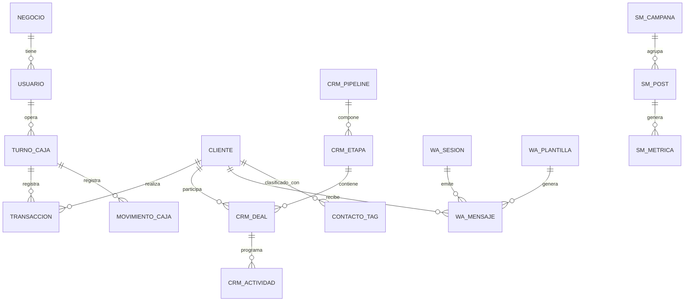

# Especificación Técnica de Arquitectura de Fusión — MejoraSuite

**Autor:** Dev IA (Ejecutor Técnico de Antigravity)  
**Supervisión:** Arquitecto Técnico & Director General  
**Repositorio Principal:** `MejoraSuite`  
**Fecha:** 28 de septiembre de 2026  
**Estado:** Documento de Diseño Aprobado para Implementación

---

## 1. Resumen Ejecutivo y Diagnóstico Actual

El ecosistema actual de *Mejora Continua* opera como un conjunto de aplicaciones independientes desarrolladas en silos con solapamiento funcional:

| Repositorio | Stack Actual | Persistencia Actual | Rol en el Ecosistema |
| :--- | :--- | :--- | :--- |
| **MejoraSuite** | Electron + Vite + React + Tailwind v3 | Estado volátil / Electron Store | Sede / Lanzador Desktop |
| **MejoraNucleo** | Electron-Vite + React + Better-SQLite3 | SQLite local (`nucleo.db`) | Motor de datos transaccional |
| **MejoraContactos** | Vite + React + TanStack Query + Virtual | Supabase Cloud + IndexedDB | Ingesta, normalización y deduplicación |
| **MejoraCRM** | Vite + React + Dnd-Kit + TanStack Query | Supabase Cloud | Pipeline de ventas y gestión comercial |
| **MejoraWS** | Electron + Vite + React + Baileys | Lowdb (JSON local) | Outreach directo y sesiones de WhatsApp |
| **MejoraSM** | Vite + React + Tailwind + Radix | Supabase Cloud + GitHub Actions | Planificación y publicación de Social Media |

### Problemas Críticos de la Arquitectura Descentralizada
1. **Dispersión de la verdad:** Los clientes viven en Supabase (CRM), en archivos Excel/CSV e IndexedDB (Contactos), en Lowdb JSON (MejoraWS) y en SQLite local (MejoraNucleo).
2. **Dependencia innecesaria de la nube:** Si se cae la conexión o expira la cuota externa, el CRM y Social Media quedan inoperables, cuando el modelo de negocio requiere soberanía de datos local en Windows.
3. **Múltiples binarios y lanzadores:** El usuario debe abrir Electron para Suite, otro Electron para MejoraWS, otro para Nucleo, y pestañas de navegador para CRM y Contactos.
4. **Duplicación de dependencias:** Múltiples bundles de React, Radix UI, Tailwind y utilitarios consumen gigabytes de almacenamiento y memoria RAM.

---

## 2. Evaluación Comparativa de Estrategias de Fusión

Se evaluaron tres enfoques arquitectónicos para consolidar las aplicaciones bajo `MejoraSuite`:



### Tabla Comparativa

| Criterio | 1. Module Federation (Vite) | 2. Monorepo Turborepo + Workspaces | 3. Multi-Window / Localhost Ports |
| :--- | :--- | :--- | :--- |
| **Acceso a SQLite nativo** | Complejo (requiere bridges IPC custom a través de iframes o remotes) | **Nativo y Directo** (Node/Electron importa el módulo DB directo) | Indirecto (requiere HTTP/WebSocket local a un daemon) |
| **Compatibilidad con Electron** | Frágil con bindings C++ (`better-sqlite3`) | **Óptima** (gestión unificada de electron-builder y rebuilds) | Descoordinada (múltiples instancias de Node/Electron) |
| **Compartición de Código/Tipos** | Requiere sincronización de contratos d.ts | **Inmediata** (TypeScript workspaces comparten interfaces) | Nula o duplicada |
| **Complejidad de Build/CI** | Alta (problemas de sincronización de versiones) | **Baja-Media** (cache centralizado por Turborepo) | Alta (múltiples builds aislados) |
| **Consumo de Memoria RAM** | Medio | **Mínimo** (un solo proceso Electron con V8 unificado) | Crítico (3 a 5 procesos Node/Chromium simultáneos) |

### Decisión de Arquitectura: Monorepo Turborepo + NPM Workspaces
Se adopta **NPM Workspaces gobernado por Turborepo**. Permite transformar las cuatro herramientas (CRM, Contactos, WS, SM) en **paquetes modulares de React** integrados directamente en el renderer de MejoraSuite, mientras `MejoraNucleo` se convierte en el **paquete de infraestructura de persistencia local (`@mejora/nucleo`)** consumido por el proceso principal de Electron.

---

## 3. Arquitectura del Motor Central de Persistencia (MejoraNucleo SQLite)

### 3.1. Ubicación Física y Parámetros del Motor
- **Archivo único:** `%APPDATA%\MejoraSuite\datos\mejora_unificada.db`
- **Driver:** `better-sqlite3` compilado para el runtime específico de Electron (`@electron/rebuild`).
- **Modos de Operación (Pragmas obligatorios):**
  ```sql
  PRAGMA journal_mode = WAL;          -- Concurrencia de lectura sin bloqueo durante escrituras
  PRAGMA synchronous = NORMAL;        -- Máxima velocidad de I/O en SSD NVMe asegurando integridad
  PRAGMA foreign_keys = ON;           -- Integridad referencial estricta
  PRAGMA busy_timeout = 5000;         -- 5 segundos de espera antes de error de lock
  PRAGMA cache_size = -64000;         -- 64 MB de cache en memoria RAM
  ```

### 3.2. Esquema Unificado de Entidades

El nuevo esquema consolida y extiende el modelo original de `MejoraNucleo`:



#### Diccionario de Dominios Unificados:
1. **Core Empresarial (de `MejoraNucleo`):**
   - `negocios`, `usuarios`, `turnos_caja`, `items` (catálogo productos/servicios), `transacciones`, `movimientos_caja`.
2. **Entidad Central Cliente/Contacto (Pivote de Contactos + CRM + WS):**
   - `clientes`: `id`, `uuid`, `nombre`, `apellido`, `telefono_e164`, `telefono_raw`, `email`, `empresa`, `cargo`, `origen` ('frontdesk_mejoraok', 'import_excel', 'whatsapp', 'manual'), `estado_calidad` ('util', 'dudoso', 'inutil'), `score_calidad`, `creado_el`, `actualizado_el`.
   - `cliente_metadatos`: Clave-valor dinámica para campos custom de CRM y campañas.
3. **Pilar CRM (`MejoraCRM`):**
   - `crm_pipelines`: Tableros de venta (Venta Directa, Consultoría, etc.).
   - `crm_etapas`: Fases del embudo (`lead`, `contacto`, `diagnostico`, `propuesta`, `cierre_ganado`, `cierre_perdido`).
   - `crm_deals`: Oportunidades comerciales vinculadas a un `cliente_id` con valor monetario, probabilidad y fecha estimada.
   - `crm_actividades`: Tareas, llamadas, reuniones, recordatorios con fechas de expiración.
4. **Pilar WhatsApp (`MejoraWS`):**
   - `wa_sesiones`: Estado de autenticación Baileys (QR, credenciales multidevice cifradas en SQLite o carpeta segura).
   - `wa_plantillas`: Mensajes personalizados con tags variables (`{{nombre}}`, `{{empresa}}`).
   - `wa_mensajes`: Registro de salidas, timestamps, estado de entrega (`pendiente`, `enviado`, `leido`, `fallido`) y respuestas.
5. **Pilar Social Media (`MejoraSM`):**
   - `sm_posts`: Copy, assets multimedia locales, dimensiones, estados (`borrador`, `aprobado`, `programado`, `publicado`).
   - `sm_calendario`: Cronograma editorial por oferta y fecha.
   - `sm_metricas`: Telemetría de engagement por post.

---

## 4. Patrón de Comunicación y Cableado (Electron IPC Bridge)

Para que los componentes de React de los 4 pilares se comuniquen con SQLite sin exponer Node.js en el frontend, se establece una capa de **RPC tipado vía Electron IPC**:

```
┌────────────────────────────────────────────────────────┐
│             RENDERER PROCESS (MejoraSuite)             │
│  ┌──────────────┬──────────────┬───────────┬─────────┐ │
│  │ Módulo CRM   │ Módulo Cont. │ Módulo WS │ Mód. SM │ │
│  └──────┬───────┴──────┬───────┴─────┬─────┴────┬────┘ │
│         │              │             │          │      │
│         └──────────────┼─────────────┴──────────┘      │
│                        ▼                               │
│              window.mejoraApi (preload.ts)             │
└────────────────────────┼───────────────────────────────┘
                         │ IPC (ContextBridge)
┌────────────────────────▼───────────────────────────────┐
│              MAIN PROCESS (Electron Node)              │
│  ┌──────────────────────────────────────────────────┐  │
│  │ IPC Router: ipcMain.handle('db:query', ...)      │  │
│  ├──────────────────────────────────────────────────┤  │
│  │ Repositorios Tipados:                            │  │
│  │   - ClientesRepository                           │  │
│  │   - CrmRepository                                │  │
│  │   - WhatsAppEngine (Baileys Service)             │  │
│  │   - SocialMediaRepository                        │  │
│  ├──────────────────────────────────────────────────┤  │
│  │ Better-SQLite3 Driver (WAL Mode + Transacciones) │  │
│  └──────────────────────┬───────────────────────────┘  │
└─────────────────────────┼──────────────────────────────┘
                          ▼
            %APPDATA%/MejoraSuite/mejora.db
```

### Contrato de la API Tipada (`window.mejoraApi`):
```typescript
export interface MejoraApi {
  // Clientes y Contactos
  clientes: {
    listar: (filtros: FiltrosClientes) => Promise<Cliente[]>;
    obtenerPorId: (id: number) => Promise<ClienteDetalle>;
    guardar: (cliente: NuevoCliente) => Promise<Cliente>;
    deduplicarBatch: (items: ContactoImportado[]) => Promise<ResultadoDedup>;
  };
  // CRM
  crm: {
    obtenerTablero: (pipelineId: number) => Promise<TableroKanban>;
    moverDeal: (dealId: number, nuevaEtapaId: number) => Promise<void>;
    crearDeal: (deal: NuevoDeal) => Promise<Deal>;
  };
  // WhatsApp
  ws: {
    obtenerEstadoSesion: () => Promise<EstadoSesionWA>;
    solicitarQr: () => Promise<string>;
    enviarMensaje: (payload: EnvioWAPayload) => Promise<ResultadoEnvio>;
  };
  // Social Media
  sm: {
    listarCalendario: (mes: number, anio: number) => Promise<PostProgramado[]>;
    guardarPost: (post: NuevoPost) => Promise<Post>;
  };
}
```

---

## 5. Estructura del Monorepo Propuesta

```
C:\github\MejoraSuite\
├── package.json               # Root monorepo con scripts de orquestación
├── turbo.json                 # Configuración de pipelines de build y dev
├── apps/
│   └── desktop/               # Aplicación Electron Principal
│       ├── electron/          # Main process, IPC handlers, SQLite manager
│       │   ├── db/            # better-sqlite3, migraciones, repositorios
│       │   ├── services/      # WhatsApp service (Baileys), Local Sync
│       │   ├── main.ts
│       │   └── preload.ts
│       ├── src/               # Shell de la Suite (Sidebar, Tabs, Status Bar)
│       │   ├── App.tsx
│       │   ├── routes.tsx
│       │   └── index.css
│       └── package.json
├── packages/
│   ├── core-db/               # Schemas de SQLite, migraciones SQL, Drizzle/Kysely
│   │   ├── migrations/
│   │   ├── schema.ts
│   │   └── client.ts
│   ├── module-crm/            # Código migrado de MejoraCRM (Vistas y Tableros)
│   │   ├── components/        # Kanban, DealModal, Pipelines
│   │   └── index.ts
│   ├── module-contactos/      # Código migrado de MejoraContactos (Filtros, Dedup)
│   │   ├── components/        # Importador, TablaVirtual, Enriquecedor
│   │   └── index.ts
│   ├── module-ws/             # Código migrado de MejoraWS (Chat UI, Campañas)
│   │   ├── components/        # QRViewer, ChatList, MessageComposer
│   │   └── index.ts
│   ├── module-sm/             # Código migrado de MejoraSM (Calendario, Diseñador)
│   │   ├── components/        # PostGrid, StoryViewer, Analytics
│   │   └── index.ts
│   ├── ui-kit/                # Componentes compartidos basados en MejoraIdentidad
│   │   ├── Button.tsx
│   │   ├── Dialog.tsx
│   │   └── tokens.css
│   └── shared-types/          # Tipos de TypeScript comunes a todo el ecosistema
```

---

## 6. Plan de Ejecución por Fases

1. **Fase A — Inicialización del Monorepo:**
   - Crear `turbo.json` y estructurar carpetas `apps/` y `packages/`.
   - Mover el motor SQLite de `MejoraNucleo` a `packages/core-db/`.
2. **Fase B — Consolidación de Base de Datos:**
   - Ejecutar la migración unificada `002_suite_unified.sql` en `better-sqlite3`.
   - Implementar los repositorios en el Proceso Principal de Electron con pruebas unitarias (`vitest`).
3. **Fase C — Modularización de los 4 Pilares:**
   - Migrar componentes de `MejoraCRM` hacia `packages/module-crm` reemplazando llamadas a `@supabase/supabase-js` por llamadas a `window.mejoraApi.crm`.
   - Migrar `MejoraContactos` reemplazando `idb` y Supabase por `window.mejoraApi.clientes`.
   - Migrar `MejoraWS` integrando el engine Baileys en el Proceso Principal de Electron y su UI en `packages/module-ws`.
   - Migrar `MejoraSM` conectando el calendario de publicaciones a SQLite local.
4. **Fase D — Distribución y Empaquetado:**
   - Configurar `electron-builder` en `apps/desktop/` para generar un único ejecutable portable y con instalador NSIS para Windows 11.

---

## 7. Estado de Situación Real (1 de Octubre de 2026)

### Hitos Consolidados en Código y en Disco
1. **Monorepo Operativo (5/5 Paquetes):** Turborepo orquesta y compila exitosamente los 5 workspaces (`@mejora/nucleo`, `@mejora/shell`, `@mejora/crm`, `@mejora/contactos`, `@mejora/sm`).
2. **Persistencia Local Soberana (19 Tablas):** Base de datos SQLite (`better-sqlite3`) en `%APPDATA%\@mejora\shell\nucleo.db` operando bajo Migraciones `001_initial_schema.sql`, `002_suite_unified.sql`, `003_suite_sm.sql` y `004_suite_ws.sql`.
3. **Desconexión Cloud y Erradicación de Lowdb:** Supabase GoTrue, IndexedDB y Lowdb desacoplados en modo de escritorio. Acceso directo a SQLite mediante adaptadores locales (`nucleoAdapter.ts`) y puente IPC (`window.suite.db.*`, `window.suite.wa.*`).
4. **Motor de WhatsApp Integrado (`wa-engine`):** Servicio de fondo asíncrono con Baileys v7, auth en `userData/wa-auth`, Bridge HTTP/SSE en `127.0.0.1:4180` y persistencia en SQLite (`ws_sesiones`, `ws_carpetas`, `ws_miembros`).
5. **Enrutamiento y UI Nativa en Shell:** Tablero `WaDashboard` en React 18 integrado junto a CRM, Contactos y Social Media con navegación unificada, dark glassmorphism y polling ligero cada 3s.

### Próximo Paso (Fase 4)
- **Empaquetado y Distribución Windows:** Configurar el pipeline final de `electron-builder` para generar los instaladores NSIS y binarios portables de MejoraSuite.


