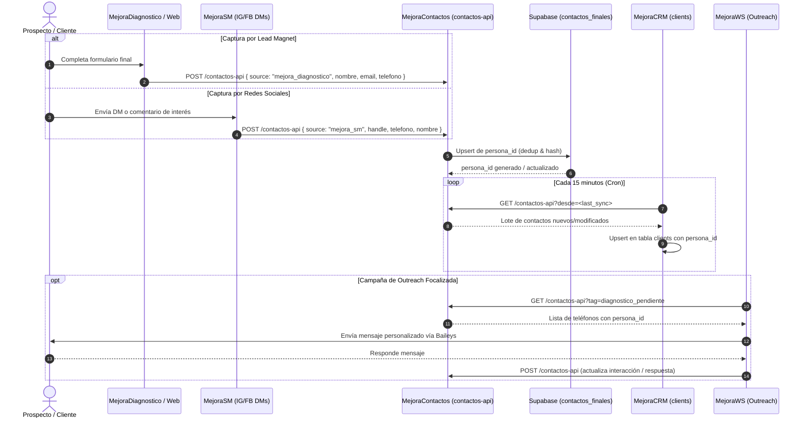

# MASTER DE ARQUITECTURA: ECOSISTEMA UNIFICADO MEJORA CONTINUA
**Documento Técnico Rector de Integración Horizontal**  
**Fecha:** 17 de septiembre de 2026  
**Autor:** Arquitecto de Software Jefe — Mejora Continua  
**Estado:** Documento Maestro Aprobado para Ejecución de Fase 1 y Plan de 7 Días  
**Ubicación:** `MejoraSuite/docs/informes/ecosistema_unificado.md`

---

## 1. Resumen Ejecutivo

El ecosistema digital de **Mejora Continua** está conformado por **10 repositorios especializados**, diseñados bajo el principio de **autonomía de repositorios** (cada sistema resuelve su dominio con su propio stack y ciclo de vida). 

Sin embargo, el diagnóstico masivo confirma un estado de **fragmentación funcional**: existen múltiples islas de datos que operan con sus propias bases de datos (Postgres en 4 proyectos Supabase distintos, SQLite locales, y archivos JSONL), lo que provoca:
1. **Fugas de leads comerciales**: Prospectos capturados en `MejoraDiagnostico`, `Mejoraok` y las redes de `MejoraSM` no ingresan de forma automática al pipeline comercial de `MejoraCRM`.
2. **Aislamiento del outreach**: `MejoraWS` depende de exportaciones manuales en Excel/CSV y no reporta de vuelta al CRM cuando un cliente responde un WhatsApp.
3. **Desconexión del cliente final**: `MejoraApp` (PWA) gestiona usuarios, diagnósticos internos y cobranzas sin alimentar la base de contactos central ni el historial de relaciones comerciales.
4. **Launcher pasivo**: `MejoraSuite` opera hoy como un mero lanzador de accesos directos de 3 herramientas, en lugar de actuar como el panel de telemetría y mando unificado del negocio.

Este informe define la **topología real**, la **matriz de desconexiones exactas**, el **contrato de datos unificado (`persona_id`)** y el **plan de ejecución de 7 días** para cerrar el circuito comercial y operativo de punta a punta sin que ningún repositorio pierda su independencia operativa.

---

## 2. Topología de los 10 Repositorios del Ecosistema

```
┌──────────────────────────────────────────────────────────────────────────────────┐
│                               MEJORA SUITE                                       │
│                       Launcher & Hub de Telemetría                               │
└──────┬──────────────────┬─────────────────┬───────────────────┬──────────────────┘
       │                  │                 │                   │
┌──────▼──────┐    ┌──────▼──────┐   ┌──────▼──────┐     ┌──────▼──────┐
│  CAPTURAS   │    │  MARKETING  │   │  OPERACIÓN  │     │   PORTAL    │
│ Diagnóstico │    │  MejoraSM   │   │  MejoraWS   │     │  MejoraApp  │
│  Mejoraok   │    │             │   │             │     │ Decisiones  │
└──────┬──────┘    └──────┬──────┘   └──────▲──────┘     └──────┬──────┘
       │                  │                 │                   │
       │ POST leads       │ POST leads      │ GET contactos     │ POST users
       │                  │                 │ POST actividad    │
       ▼                  ▼                 │                   ▼
┌───────────────────────────────────────────┴──────────────────────────────────────┐
│                         MEJORA CONTACTOS (Truth Engine)                          │
│          Postgres Supabase · contactos_finales · persona_id · contactos-api      │
└─────────────────────────────────────┬────────────────────────────────────────────┘
                                      │
                         Bidireccional│ Push / Pull
                                      ▼
┌──────────────────────────────────────────────────────────────────────────────────┐
│                           MEJORA CRM (Core Rector)                               │
│       Gestión comercial · Pipeline · Cotizaciones · Interacciones · Clients      │
└──────────────────────────────────────────────────────────────────────────────────┘
                                      │
                           Tokens     │ Lineamientos
                                      ▼
┌──────────────────────────────────────────────────────────────────────────────────┐
│                         MEJORA IDENTIDAD (Brand Engine)                          │
│      Manual de Marca · Tipografías · Logos · Reglas de Voz · Buyer Personas      │
└──────────────────────────────────────────────────────────────────────────────────┘
```

### Inventario Técnico Detallado

| # | Repositorio | Stack | Rol en el Negocio | Backend / Persistencia | Dominio / Endpoint |
|---|---|---|---|---|---|
| 1 | **MejoraContactos** | Python (motor dedup) + React (Vite) | **Fuente Única de Verdad** de Identidad | SQLite local + Supabase (`contactos_finales`, `contactos_api_keys`) | `pabloeckert.github.io/MejoraContactos/` + Edge Function `contactos-api` |
| 2 | **MejoraCRM** | React + Vite + Tailwind | **Núcleo Rector Comercial** (SaaS Multi-tenant) | Supabase propio (`clients`, `interactions`, `opportunities`) | `crm.mejoraok.com` |
| 3 | **MejoraDiagnostico** | Next.js 14 (App Router) + Tailwind | **Boca de Captura Principal** (Lead Magnet) | Google Sheets + Resend + Telegram + SessionStorage | `diagnostico.mejoraok.com` |
| 4 | **MejoraApp** | React 18 + Vite (shadcn/ui) + PWA | **Portal Cliente Final & Comunidad** | Supabase propio (`profiles`, `business_mirror_results`, `payments`) | PWA en producción |
| 5 | **MejoraWS** | Electron + React + Baileys | **Outreach Directo WhatsApp** | Archivos locales JSONL (`logs/actividad.jsonl`) + SQLite | Desktop App (`mejoraws://`) |
| 6 | **MejoraSM** | React + Vite + Deno (11 Edge Functions) | **Marketing & Redes Sociales** | Supabase propio (15 tablas, `inbox_items`, vault) + Zernio API | `mejorasm.mejoraok.com` |
| 7 | **MejoraSuite** | Electron + JavaScript + IPC | **Launcher & Panel de Control** | Local (IPC bridge, single-instance lock) | Desktop App |
| 8 | **MejoraIdentidad** | Markdown, PDF, Assets, Claude Skill | **Fuente de Verdad de Marca** | Archivos estáticos, fuentes Bw Modelica/League Spartan | Repositorio documental y skill |
| 9 | **Mejoraok** | React + Vite + TanStack Router | **Sitio Institucional Público** | Supabase propio (Lovable Cloud) | `mejoraok.com` |
| 10 | **MejoraDecisiones** | React 19 + Vite 5 + Tailwind v4 + Recharts | **Inteligencia Política & Tablero Nash** | APIs públicas (BCRA, DolarAPI, INDEC) + Memoria local | `pabloeckert.github.io/MejoraDecisiones/` |

---

## 3. Mapeo de Flujos de Datos: Estado Actual vs. Estado Objetivo

### 3.1 Estado Actual (Silos Aislados)
* **Diagnóstico**: El usuario responde el test y llena nombre/teléfono en `/datos`. Los datos se van a un Google Sheet y a un bot de Telegram. Acaba de agregarse la llamada `enviarLead`, pero no hay Edge Function activa en destino.
* **CRM**: Los clientes se cargan a mano en `ClientFormDialog` o por importación CSV. El vendedor desconoce si el contacto ya existía en MejoraContactos o si completó el Diagnóstico.
* **WhatsApp (WS)**: El usuario descarga un Excel de cualquier lado, lo sube a la app de escritorio, envía mensajes y las respuestas quedan confinadas en un JSONL en su disco `C:\`.
* **Social Media (SM)**: Clientes potenciales preguntan precios en comentarios o DMs de Instagram/Facebook. Quedan en `inbox_items` de MejoraSM; nadie los pasa al CRM.
* **MejoraApp**: Los miembros se registran con email/password, realizan diagnósticos internos y pagan membresías. Ninguno de estos registros se consolida con el CRM de ventas.

### 3.2 Estado Objetivo (Circuito Comercial Unificado)



---

## 4. Matriz de Desconexiones Críticas y Puntos Ciegos

| Disrupción | Repositorios Implicados | Componente Afectado | Impacto en el Negocio | Causa Raíz Técnica |
|---|---|---|---|---|
| **D1: Inexistencia de Gateway Activo en Supabase** | `MejoraContactos` ↔ Todos | `supabase/functions/contactos-api/index.ts` | **Bloqueo Total**: Cualquier intento de POST desde `MejoraDiagnostico` o `MejoraCRM` recibe HTTP 404 o falla de red. | La Edge Function está escrita y verificada con Deno local, pero nunca fue desplegada con `supabase functions deploy`. |
| **D2: Clave de autenticación no generada** | `MejoraDiagnostico`, `MejoraCRM` | `.env.local` (`NEXT_PUBLIC_CONTACTOS_API_KEY`) | Intentos de request son rechazados con 401 Unauthorized. | Falta insertar el hash SHA-256 en la tabla `contactos_api_keys` de Supabase y distribuir la key plana en los `.env`. |
| **D3: Silo de Outreach WhatsApp** | `MejoraWS` ↔ `MejoraContactos` / `MejoraCRM` | `MejoraWS/src/` y `logs/actividad.jsonl` | La prospección se hace a ciegas. Si un prospecto responde positivamente por WhatsApp, el equipo de ventas en el CRM no lo sabe. | `MejoraWS` no tiene módulo HTTP para consultar `contactos-api` ni reportar callbacks de `actividad.jsonl`. |
| **D4: Leads Sociales Atrapados** | `MejoraSM` ↔ `MejoraCRM` | `MejoraSM/supabase/functions/inbox/` | Prospectos con alta intención de compra en Instagram/LinkedIn quedan olvidados en una bandeja de CM. | `inbox_items` no dispara webhook ni llamada a `contactos-api` al clasificar un mensaje como lead calificado. |
| **D5: Doble Identidad de Cliente App vs. CRM** | `MejoraApp` ↔ `MejoraCRM` | `MejoraApp/src/integrations/supabase/` | El cliente que ya paga en la App figura como "lead frío" en el CRM o viceversa. | `profiles` de `MejoraApp` usa el `user.id` de Supabase Auth, sin almacenar ni mapear el `persona_id` unificado. |
| **D6: Riesgo de Contaminación Multi-Tenant** | `MejoraCRM` | `supabase/functions/pull-contactos/` | En caso de incorporar clientes B2B al CRM, sus contactos se mezclarían con la base general de Mejora Continua. | `pull-contactos` sincroniza ciegamente sin filtrar por `organization_id`. |
| **D7: Vulnerabilidad Abierta de Credenciales** | `MejoraCRM` | Supabase Dashboard | Riesgo de seguridad: key de `service_role` potencialmente expuesta en historial histórico de git. | Rotación de API key postergada manualmente en el dashboard de Supabase. |

---

## 5. Matriz de Integración Horizontal

Para que los sistemas hablen en horizontal sin acoplar sus bases de datos, se establece el **Protocolo de Identidad Distribuida** basado en `contactos-api`.

### 5.1 Especificación del Contrato de Datos (`contactos-api`)

* **Endpoint Base:** `https://tzatuvxatsduuslxqdtm.supabase.co/functions/v1/contactos-api`
* **Autenticación:** Header `X-Api-Key: <TOKEN_SISTEMA>` (o `Authorization: Bearer <TOKEN_SISTEMA>`)
* **Headers Estándar:** `Content-Type: application/json`

#### Formato Canónico del Payload (Ingreso de Leads)
```json
{
  "source": "mejora_diagnostico | mejora_app | mejora_sm | mejora_ws | mejoracrm",
  "email": "juan.perez@empresa.com",
  "nombre": "Juan",
  "apellido": "Pérez",
  "telefono": "+5493764123456",
  "cargo": "Director General",
  "organizacion": "Maderas del Norte S.A.",
  "metadata": {
    "perfil_diagnostico": "SATURADO",
    "puntaje_global": 72,
    "campana_origen": "ig_carrusel_septiembre"
  }
}
```

#### Respuesta de la API
```json
{
  "ok": true,
  "persona_id": "9b1deb4d-3b7d-4bad-9bdd-2b0d7b3dcb6d",
  "creado": true,
  "mensaje": "Contacto registrado y encolado para sincronización CRM"
}
```

### 5.2 Roles por Sistema en la Matriz

| Sistema | Permiso en API | Frecuencia | Operaciones Permitidas |
|---|---|---|---|
| **MejoraDiagnostico** | Escritura (`puede_escribir: true`) | Event-driven (al enviar form) | POST nuevo lead |
| **Mejoraok** | Escritura (`puede_escribir: true`) | Event-driven (al enviar form) | POST consulta comercial |
| **MejoraSM** | Escritura (`puede_escribir: true`) | Event-driven (al etiquetar lead en inbox) | POST lead social calificado |
| **MejoraCRM** | Lectura & Escritura | Cron cada 15 min + Event-driven (alta manual) | GET incremental (`?desde=`), POST push cliente |
| **MejoraWS** | Lectura & Escritura | On-demand (al abrir campaña) + Event-driven | GET contactos para campaña, POST estado de respuesta |
| **MejoraApp** | Escritura | Event-driven (alta de usuario o diagnóstico) | POST datos de perfil de usuario |
| **MejoraSuite** | Lectura (Admin) | Polling cada 60s | GET `/health` y métricas globales de sync |

---

## 6. Plan de Despliegue de 7 Días (Cierre del Circuito Comercial)

Este plan ejecuta la unión horizontal del ecosistema **sin romper la autonomía** ni detener la operación diaria de ningún repositorio.

```
Día 1: Despliegue del Gateway Central (MejoraContactos)
Día 2: Activación y Validación de Captura (MejoraDiagnostico + Mejoraok)
Día 3: Conexión del Núcleo Rector (MejoraCRM ↔ Contactos)
Día 4: Enlace del Canal de Outreach (MejoraWS ↔ Contactos)
Día 5: Enlace de Marketing y Social Inbound (MejoraSM ↔ Contactos)
Día 6: Unificación de Clientes y Portal (MejoraApp ↔ Contactos/CRM)
Día 7: Activación de Telemetría y Mando Unificado (MejoraSuite)
```

---

### Día 1: Activación y Aseguramiento de la Fuente de Verdad (`MejoraContactos`)
* **Objetivo:** Poner en producción el Gateway `contactos-api` con seguridad blindada y emitir las API keys por sistema.
* **Acciones:**
  1. Ejecutar en el proyecto Supabase de MejoraContactos la migración de doble vía: `20260916_contactos_finales_two_way.sql`.
  2. Desplegar la Edge Function con Supabase CLI:
     ```bash
     supabase functions deploy contactos-api --project-ref tzatuvxatsduuslxqdtm
     ```
  3. Generar tokens criptográficos (SHA-256) para:
     - `mejoradiagnostico` (escritura)
     - `mejoracrm` (lectura/escritura)
     - `mejoraws` (lectura/escritura)
     - `mejorasm` (escritura)
     - `mejoraapp` (escritura)
  4. Insertar las keys en `contactos_api_keys` con sus respectivos permisos `puede_escribir`.
  5. Rotar la `service_role` key de `MejoraCRM` en su Dashboard de Supabase para cerrar el riesgo R1.

---

### Día 2: Cierre de la Boca de Captura (`MejoraDiagnostico` + `Mejoraok`)
* **Objetivo:** Garantizar que el 100% de los diagnósticos completados se conviertan en identidades universales con `persona_id`.
* **Acciones:**
  1. En `MejoraDiagnostico`:
     - Configurar en `.env.local` y en variables de entorno de Vercel la variable `NEXT_PUBLIC_CONTACTOS_API_KEY` emitida en el Día 1.
     - Actualizar la URL de destino en `app/datos/page.tsx` reemplazando `[TU_PROYECTO_CONTACTOS]` por el ref real: `https://tzatuvxatsduuslxqdtm.supabase.co/functions/v1/contactos-api`.
  2. Probar un envío real de prueba y verificar en la tabla `contactos_sync_log` que la operación `push_create` impactó correctamente con `origen = 'mejora_diagnostico'`.
  3. Replicar el conector liviano `enviarLead` en los formularios de contacto de `Mejoraok`.

---

### Día 3: Enlace del Núcleo Rector Comercial (`MejoraCRM`)
* **Objetivo:** Habilitar la doble vía para que los prospectos de diagnóstico aparezcan automáticamente en el pipeline de ventas del CRM y viceversa.
* **Acciones:**
  1. Aplicar en Supabase de MejoraCRM la migración `20260916_clients_persona_id.sql` (agrega columnas `persona_id`, `origen`, `contactos_synced_at`).
  2. Desplegar las Edge Functions de MejoraCRM:
     ```bash
     supabase functions deploy push-contacto
     supabase functions deploy pull-contactos
     ```
  3. Configurar en Supabase Secrets de MejoraCRM:
     - `CONTACTOS_API_URL` = `https://tzatuvxatsduuslxqdtm.supabase.co/functions/v1/contactos-api`
     - `CONTACTOS_API_KEY` = `<KEY_DE_MEJORACRM>`
     - `ORGANIZATION_ID_DEFAULT` = `<ID_ORGANIZACION_MEJORA_CONTINUA>` (resolución de R6: aislamiento multi-tenant).
  4. Activar el workflow de GitHub Actions `.github/workflows/pull-contactos-cron.yml` para correr el pull cada 15 minutos.

---

### Día 4: Integración del Canal de Outreach (`MejoraWS`)
* **Objetivo:** Eliminar la importación manual por Excel y reportar interacciones de WhatsApp directamente al ecosistema.
* **Acciones:**
  1. Agregar en `MejoraWS/src/` un módulo cliente `contactosService.ts`:
     - Función `obtenerContactosCampana(tag)`: consume `contactos-api` (GET) para cargar listas directas a la bandeja de envío.
     - Función `reportarRespuesta(telefono, respuesta)`: envía un POST a `contactos-api` cuando el listener de Baileys detecta un mensaje entrante.
  2. Modificar `electron/main.mjs` de MejoraWS para permitir requests autorizados hacia el dominio de Supabase.
  3. Dejar el importador de Excel/CSV como mecanismo de contingencia offline (fail-soft).

---

### Día 5: Integración Inbound de Redes Sociales (`MejoraSM`)
* **Objetivo:** Convertir comentarios y mensajes directos de redes en prospectos comerciales calificados.
* **Acciones:**
  1. En `MejoraSM/supabase/functions/inbox/`:
     - Interceptar la clasificación positiva de leads realizada por el LLM.
     - Si el mensaje contiene intención de compra o datos de contacto (teléfono/email), invocar de forma asíncrona a `contactos-api` (POST) con `source: "mejora_sm"`.
  2. Etiquetar automáticamente al contacto con el tag `origen: redes_sociales` y la red de procedencia (`instagram`, `facebook`, `linkedin`).
  3. En `MejoraSM/src/pages/Conversaciones.tsx`, añadir un botón explícito: *"Enviar a CRM"* para traspaso manual de casos dudosos con un solo clic.

---

### Día 6: Unificación de Usuarios de Plataforma (`MejoraApp` & `MejoraDecisiones`)
* **Objetivo:** Unificar la identidad de los usuarios de la PWA con la base maestra de contactos y articular el acceso a herramientas de decisión.
* **Acciones:**
  1. En `MejoraApp`:
     - Crear un trigger en Supabase sobre `auth.users` / `profiles` para que cada alta de usuario envíe un evento a `contactos-api` con `source: "mejora_app"`.
     - Vincular el resultado de diagnósticos internos (`business_mirror_results`) al registro del cliente.
  2. En `MejoraDecisiones`:
     - Implementar lectura de sesión / token para permitir acceso directo a clientes con membresía activa provenientes de `MejoraApp` o `MejoraCRM`.

---

### Día 7: Tablero de Comando y Telemetría Unificada (`MejoraSuite`)
* **Objetivo:** Transformar a MejoraSuite de un lanzador simple a un monitor central del estado y salud del ecosistema.
* **Acciones:**
  1. Actualizar `MejoraSuite/public/index.html` y `renderer.js`:
     - Incorporar tarjetas de estado en tiempo real (Status Badges) para cada uno de los subsistemas:
       * MejoraContactos: Total contactos unificados / Último sync
       * MejoraCRM: Leads ingresados hoy / Tasa de conversión
       * MejoraDiagnostico: Formularios completados en las últimas 24h
       * MejoraWS: Estado del demonio local / Mensajes enviados hoy
       * MejoraSM: Campañas activas / Leads capturados en redes
  2. Crear un endpoint liviano de diagnóstico de salud en `contactos-api` (`GET /contactos-api/health`) para que el Launcher verifique la conectividad global en el arranque.
  3. Empaquetar y distribuir la versión final de MejoraSuite.

---

## 7. Principios Arquitectónicos de No-Invasión (Gobernanza)

Para mantener la velocidad y evitar dependencias cruzadas destructivas, toda integración futura debe respetar estos 4 postulados:

1. **Fail-Soft Obligatorio:** Si `contactos-api` no responde o se cae la red, **ninguna aplicación debe detener su funcionamiento básico**. Diagnostico debe seguir mostrando el PDF, CRM debe permitir guardar el cliente localmente, y WS debe seguir enviando mensajes.
2. **Desacoplamiento por API Key Hashing:** Ninguna aplicación cliente (frontend) ni servicio satélite almacena la clave `service_role` de Supabase. Cada repo recibe exclusivamente su propio token revocable verificado mediante hash SHA-256.
3. **Inmutabilidad de `persona_id`:** Una vez asignado un `persona_id` a un contacto mediante el algoritmo de clusters de MejoraContactos, este UUID no cambia ni se recalcula; viaja como identificador único universal a través de todas las tablas satélites (`clients.persona_id`, `profiles.persona_id`).
4. **Respeto a la Identidad de Marca Central (`MejoraIdentidad`):** Ninguna interfaz de la suite puede utilizar paletas arbitrarias ni fuentes del sistema. Todo desarrollo debe consumir los tokens oficiales: Azul Corporativo (`#1A3D84`), Amarillo Acción (`#F7CC13`), Bw Modelica (títulos/cuerpo) y League Spartan (soporte).

---
*Fin del Documento Maestro. Aprobado para ejecución técnica inmediata.*
